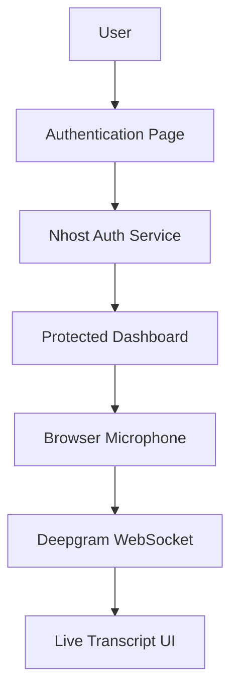

<p align="center">

</p>

<div align="center">


</div>

<div align="center">


</div>

<div align="center">


</div>

<div align="center">

<a href="https://vocallab-assessment.vercel.app/">

</a>
<a href="https://github.com/Xatyam07/Vocallab-assessment">

</a>

</div>

<br>

> VocalLab Assessment is a full-stack web application built for an SDE Intern Live Coding Assessment, combining secure Nhost authentication with real-time speech-to-text transcription powered by Deepgram. Users sign up, log in, land on a protected dashboard, and convert live microphone audio into text in real time.

---

## 📑 Table of Contents

- [Overview](#-overview)
- [Assessment Requirements](#-assessment-requirements)
- [Features](#-features)
- [Architecture](#️-architecture)
- [Tech Stack](#-tech-stack)
- [Project Structure](#-project-structure)
- [Getting Started](#-getting-started)
- [Environment Variables](#️-environment-variables)
- [Nhost Setup](#-nhost-setup)
- [Deepgram Setup](#️-deepgram-setup)
- [Testing Flow](#-testing-flow)
- [Evaluation Criteria Addressed](#-evaluation-criteria-addressed)
- [Security](#-security)
- [Deployment](#-deployment)
- [Roadmap](#-roadmap)
- [Author](#-author)
- [Acknowledgements](#-acknowledgements)
- [License](#-license)

---

## 📌 Overview

This project combines:

- 🔐 Secure Authentication using Nhost
- 🎤 Real-time Speech-to-Text Transcription using Deepgram
- 🛡️ Protected Dashboard Routes
- ⚡ Live Transcript Updates
- 💾 Persistent User Sessions

---

## 🎯 Assessment Requirements

<table>
<tr>
<td width="50%">

**Authentication Module**
- User Signup
- User Login
- Session Persistence
- Protected Dashboard Access
- Nhost Authentication Integration

</td>
<td width="50%">

**Speech-to-Text Dashboard**
- Browser Microphone Access
- Live Audio Streaming
- Deepgram WebSocket Integration
- Real-Time Transcript Rendering
- Dashboard-Based User Experience

</td>
</tr>
</table>

---

## ✨ Features

<table>
<tr>
<td width="33%">

**🔐 Authentication**
- Email and Password Signup
- Secure Login
- Session Persistence
- Logout Functionality
- Protected Routes

</td>
<td width="33%">

**🎤 Live Speech Recognition**
- Real-Time Audio Capture
- WebSocket Streaming
- Instant Transcript Updates
- Continuous Speech Processing
- Browser-Based Recording

</td>
<td width="33%">

**🎨 User Experience**
- Clean UI
- Responsive Design
- Fast Navigation
- Real-Time Feedback

</td>
</tr>
</table>

---

## 🏗️ Architecture



---

## 🛠️ Tech Stack

<div align="center">


</div>

| Category | Technology |
|-----------|------------|
| Frontend | React 19 |
| Language | JavaScript |
| Build Tool | Vite |
| Authentication | Nhost |
| Speech Recognition | Deepgram |
| Styling | CSS / Tailwind |
| Deployment | Vercel |

---

## 📂 Project Structure

```bash
src/
│
├── components/
│   ├── Login
│   ├── Signup
│   └── Dashboard
│
├── hooks/
│
├── services/
│   ├── nhost.ts
│   └── deepgram.ts
│
├── routes/
│
├── pages/
│
├── context/
│
├── App.tsx
└── main.tsx
```

---

## 🚀 Getting Started

### 1. Clone the repository

```bash
git clone https://github.com/Xatyam07/Vocallab-assessment.git
cd Vocallab-assessment
```

### 2. Install dependencies

```bash
npm install
```

### 3. Set up environment variables

Create a `.env` file (see [Environment Variables](#️-environment-variables) below).

### 4. Run the development server

```bash
npm run dev
```

App runs at:

```bash
http://localhost:5173
```

---

## ⚙️ Environment Variables

**`.env`**

```env
VITE_NHOST_SUBDOMAIN=your_subdomain
VITE_NHOST_REGION=your_region

VITE_DEEPGRAM_API_KEY=your_deepgram_api_key
```

---

## 🔑 Nhost Setup

1. Create a free Nhost account
2. Create a new project
3. Enable Email Authentication
4. Copy your **Subdomain** and **Region**
5. Add them to `.env`

---

## 🎙️ Deepgram Setup

1. Create a Deepgram account
2. Generate an API Key
3. Add the key to `.env`
4. Start microphone streaming through the WebSocket API

---

## 🧪 Testing Flow

<table>
<tr>
<td width="50%">

**Authentication**
- Create Account
- Login
- Refresh Page
- Verify Session Persistence

</td>
<td width="50%">

**Dashboard**
- Access Protected Route
- Start Recording
- Speak into Microphone
- Watch Transcript Update Live

</td>
</tr>
</table>

---

## 📈 Evaluation Criteria Addressed

| Criteria | Implementation |
|-----------|--------------|
| Working Product | ✅ Complete End-to-End Flow |
| Speed and Focus | ✅ Core Requirements Delivered |
| Code Sense | ✅ Modular Structure |
| Resourcefulness | ✅ Nhost + Deepgram Integration |
| Creativity | ✅ Modern Dashboard Experience |

---

## 🔒 Security

- API Keys stored in Environment Variables
- Protected Routes
- Authenticated Access Only
- Session-Based Authentication

---

## 🚀 Deployment

<div align="center">


</div>

```bash
npm run build
```

Deploy the `dist/` output to Vercel, Netlify, or Render.

---

## 🔮 Roadmap

- [ ] Export Transcript
- [ ] Transcript History
- [ ] Multi-Language Recognition
- [ ] AI Summary Generation
- [ ] Voice Analytics
- [ ] User Profile Management

---

## 👨‍💻 Author

<div align="center">

### Satyam Mishra

<a href="https://github.com/Xatyam07">

</a>
<a href="https://satyam07portfolio.vercel.app">

</a>
<a href="https://www.linkedin.com/in/satyam-mishra-786by4">

</a>

</div>

---

## ⭐ Acknowledgements

- Nhost Authentication
- Deepgram Speech API
- React Ecosystem
- Vite Development Environment

---

## 📄 License

This project was developed for an SDE Intern Live Coding Assessment and is intended for educational and demonstration purposes.

---

<div align="center">

⭐ If you found this project interesting, consider giving it a star!


</div>
